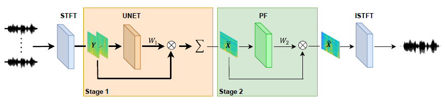

# ExNet-BF-PF: Explainable DNN-based Beamformer with Postfilter

[Paper]() |
[Demo Page](https://exnet-bf-pf.github.io/) |
[Abstract](#Abstract) |
[Pretrained Models](#pretrained-models) |
[Dataset](#Dataset) 

## Description 
This repository contains the code for the paper "ExNet-BF-PF: Explainable DNN-based Beamformer with Postfilter".

## Demo Page
The [demo page](https://exnet-bf-pf.github.io/) presents audio test samples along with their spectrograms, showcasing a comparison between our proposed method, "ExNet-BF+PF", and other competing methods. 

## Authors
Adi Cohen, Daniel Wong, Jung-Suk Lee and Sharon Gannot

## Abstract
This paper introduces an explainable DNN-based beamformer with a postfilter (ExNet-BF+PF) for 
multichannel signal processing. Our approach combines the U-Net network with a beamformer 
structure to address this problem. The method involves a two-stage processing pipeline. In the
first stage, time-invariant weights are applied to construct a multichannel spatial filter, namely
a beamformer. In the second stage, a time-varying single-channel post-filter is applied at the 
beamformer output. Additionally, we incorporate an attention mechanism inspired by its successful 
application in noisy and reverberant environments to improve speech enhancement further.
Furthermore, our study fills a gap in the existing literature by conducting a thorough spatial 
analysis of the network's performance. Specifically, we examine how the network utilizes spatial 
information during processing. This analysis yields valuable insights into the network's 
functionality, thereby enhancing our understanding of its overall performance.
Experimental results demonstrate that our approach is not only straightforward to train but also 
yields superior results, obviating the necessity for prior knowledge of the speaker's activity.

## Dataset
We constructed a comprehensive dataset for training the network, comprising noisy signals simulated under 
various environmental conditions, including reverberant and non-reverberant environments. Each signal 
consists of a target speaker, directional noise, and additional spatially and spectrally white noise. 
The dataset includes signals with different types of noise generated for each environment:
1. Time-Varying Noise: The noise direction switched after 2[sec].
2. Speaker Switching: The speaker and its direction switched after 2[sec].
3. Babble Noise: Babble noise was generated by combining ten colored noise signals at various distances.
4. Babble Voice: Babble voice was generated by combining ten speakers at different distances.

Further details on the dataset creation process are described in the accompanying article.
You can find examples of all dataset types at the following link:
[Dataset Examples](https://drive.google.com/drive/folders/1EzqU7MO1HYvsyF4GJG_BNWJnOIC96Hgo?usp=drive_link)

## Pretrained Models
We offer pre-trained weights for both reverberant and non-reverberant environments.
You can download the pre-trained weights from the following link:
[Models](https://drive.google.com/drive/folders/1MxUU3xrG22Bow9SdJm-A0cQd7xfcvhmc?usp=drive_link)

